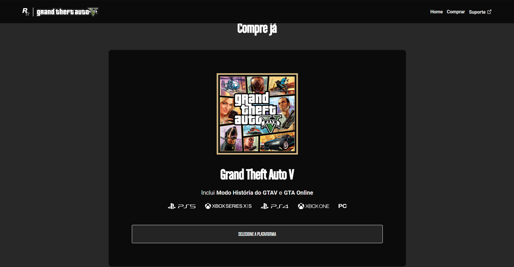
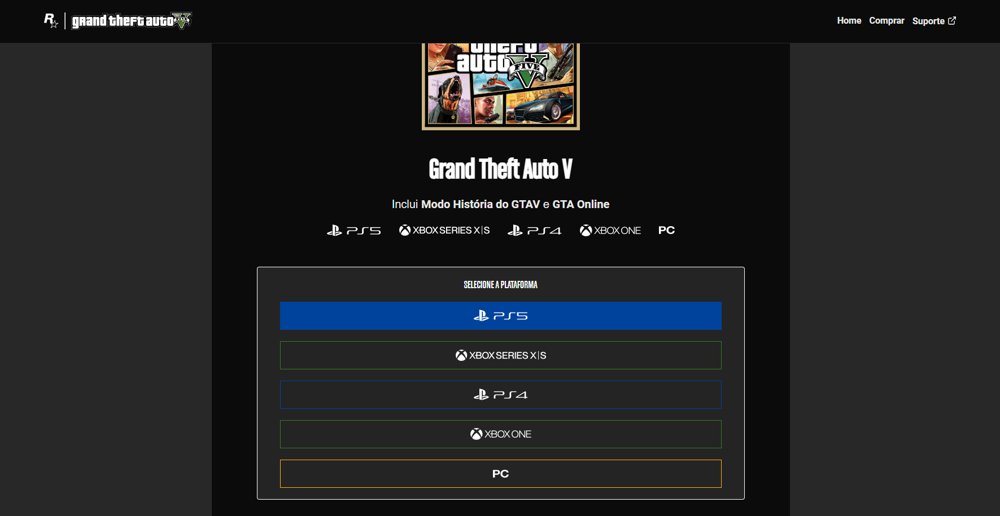

# Landing Page GTA V

## Descrição
O projeto landing page gta v é um site interativo que permite aos usuários selecionar diferentes plataformas de jogos, e com ação de suporte diretamente com a Rockstar games.

## Conteúdo

1. [Instalação](#instalação)
2. [Como Usar](#como-usar)
4. [Licença](#licença)

## Instalação

1. Clone o repositório:

    ```bash
    git clone https://github.com/NiloMarcos/landing-page-gta.git
    ```

2. Navegue até o diretório do projeto:

    ```bash
    cd landing-page-gta
    ```

## Como Usar

1. Inicie o visual studio code com:

    ```bash
    code .
    ```

2. Leia as informações do site e as interações.

3. Clique no botão "Selecione a plataforma" para ver as opções disponíveis e com os respectivos links do jogos para cada plataforma.


## Licença

Este projeto está licenciado sob a [Licença MIT](LICENSE).

### Apresentação da aplicação
<p align="center">

<tr>
  <td>
    
  </td>
  <td>
    
  </td>
  <td>
    
  </td>
</tr>

